# arquitetura_aws

Este repositório contém a primeira atividade avaliativa do programa de estágio da Compass (PB 20/03/2023). Dentro da atividade proposta, o documento a seguir é o que compreende a parte prática do exercício, envolvendo conhecimentos em infraestrutura da Amazon Web Services (AWS) e Linux.

<h3>Requisitos do exercício</h3>
<h5>Requisitos AWS:</h5>
<ul>
<li>Gerar uma chave pública para acesso ao ambiente; 
<li>Criar 1 instância EC2 com o sistema operacional Amazon Linux 2 (Família t3.small,
16 GB SSD); 
<li>Gerar 1 elastic IP e anexar à instância EC2; 
<li>Liberar as portas de comunicação para acesso público: (22/TCP, 111/TCP e UDP,
2049/TCP/UDP, 80/TCP, 443/TCP).
</ul>
<h5>Requisitos no linux:</h5>
<ul>
<li>Configurar o NFS entregue; 
<li>Criar um diretorio dentro do filesystem do NFS com seu nome; 
<li>Subir um apache no servidor - o apache deve estar online e rodando; 
<li>Criar um script que valide se o serviço está online e envie o resultado da validação
para o seu diretorio no nfs; 
<li>O script deve conter - Data HORA + nome do serviço + Status + mensagem
personalizada de ONLINE ou offline; 
<li>O script deve gerar 2 arquivos de saida: 1 para o serviço online e 1 para o serviço
OFFLINE; 
<li>Preparar a execução automatizada do script a cada 5 minutos; 
<li>Fazer o versionamento da atividade; 
<li>Fazer a documentação explicando o processo de instalação do Linux.
</ul>

<h3>Execução dos requisitos do exercício</h3>

<h5>Gerando uma chave pública na AWS:</h5>
Este processo refere-se a geração de um par de chaves no serviço de instâncias da AWS e, neste caso, é realizado através da console web. 
<ol>
  <li>No console web da AWS, através do menu 'Serviços', no canto superior esquerdo, acesse o serviço de 'EC2' (Elastic Compute Cloud). O termo 'EC2' também pode ser buscado através da barra de pesquisa, no topo da página. 
  <li>Na coluna esquerda, na sessão 'Redes e segurança', clique em 'Pares de chaves'. 
  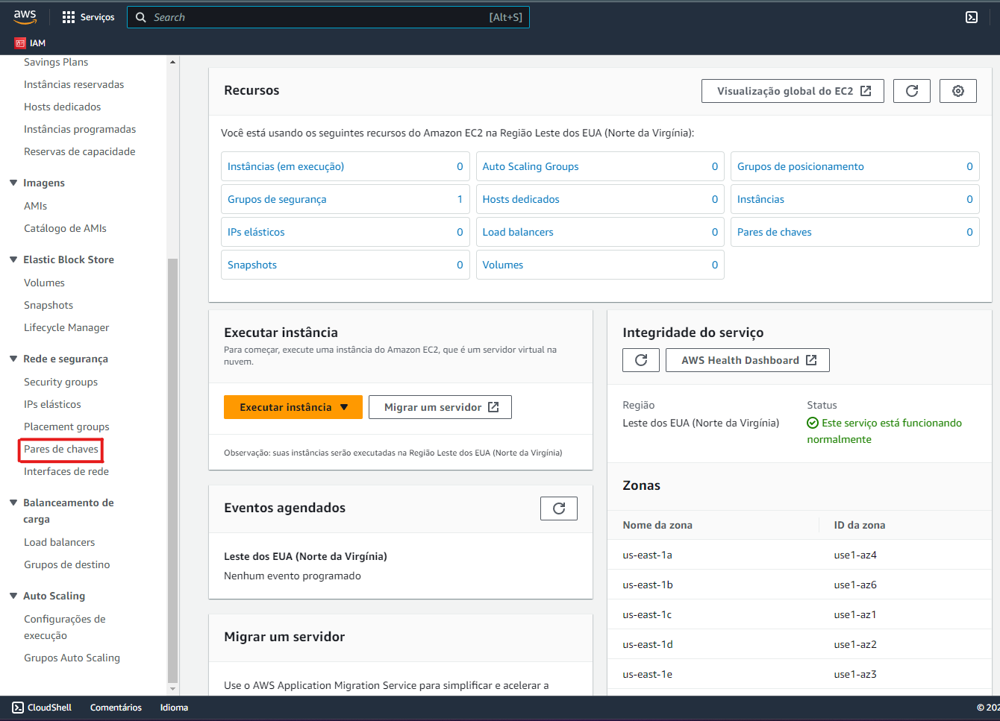 
  <li>Para criar um par de chaves, clique no botão ('Criar par de chaves') no canto superior direito da página. 
  <li>Atribua um nome, selecione o tipo de par de chaves, o formato do arquivo (.pem para OpenSSH e .ppk para uso com Putty) e uma tag (opcional). 
  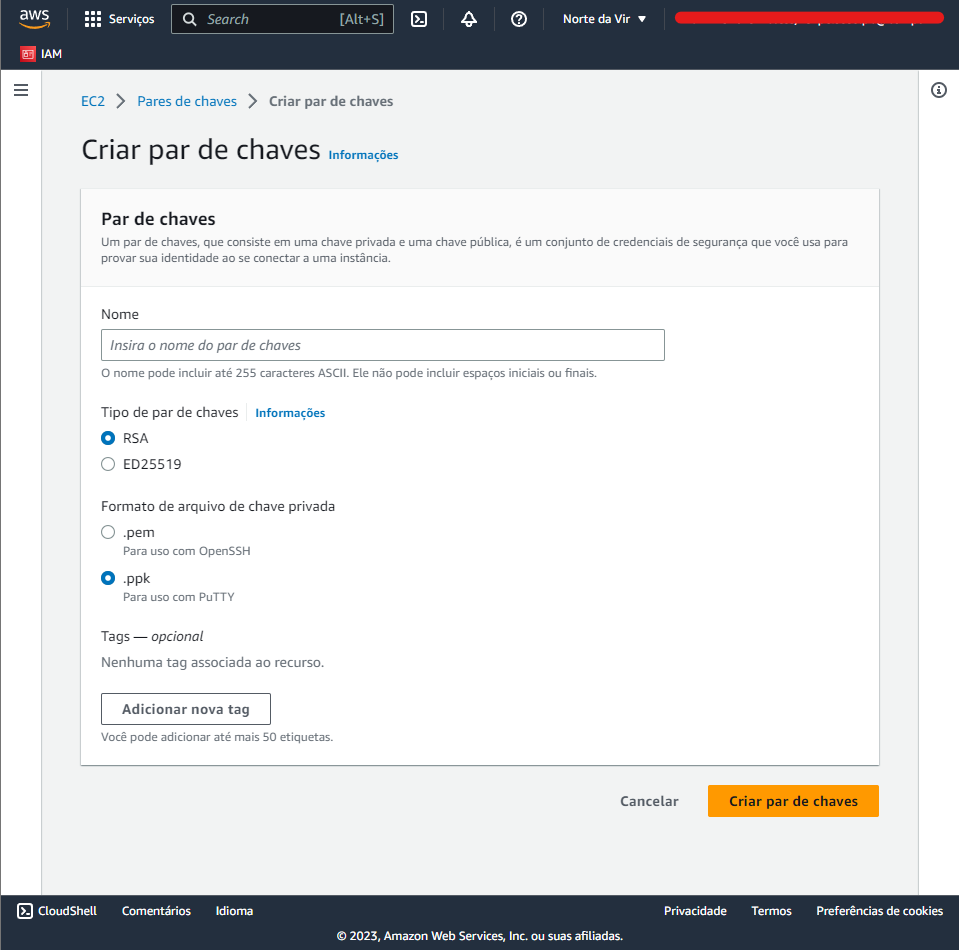 
  <li>Após finalizar a operação, salve o arquivo baixado em local seguro.
</ol>

<h5>Criação de uma instância EC2:</h5>
Este processo refere-se à criação de uma instâncias EC2 com o sistema operacional Amazon Linux 2 (Família t3.small,
16 GB SSD), neste caso, realizado através da console web. 
<ol>
  <li>No console web da AWS, através do menu 'Serviços', no canto superior esquerdo, acesse o serviço de 'EC2' (Elastic Compute Cloud). O termo 'EC2' também pode ser buscado através da barra de pesquisa, no topo da página. 
  <li>Na coluna esquerda, na sessão 'Instâncias', clique em 'Instâncias'. 
  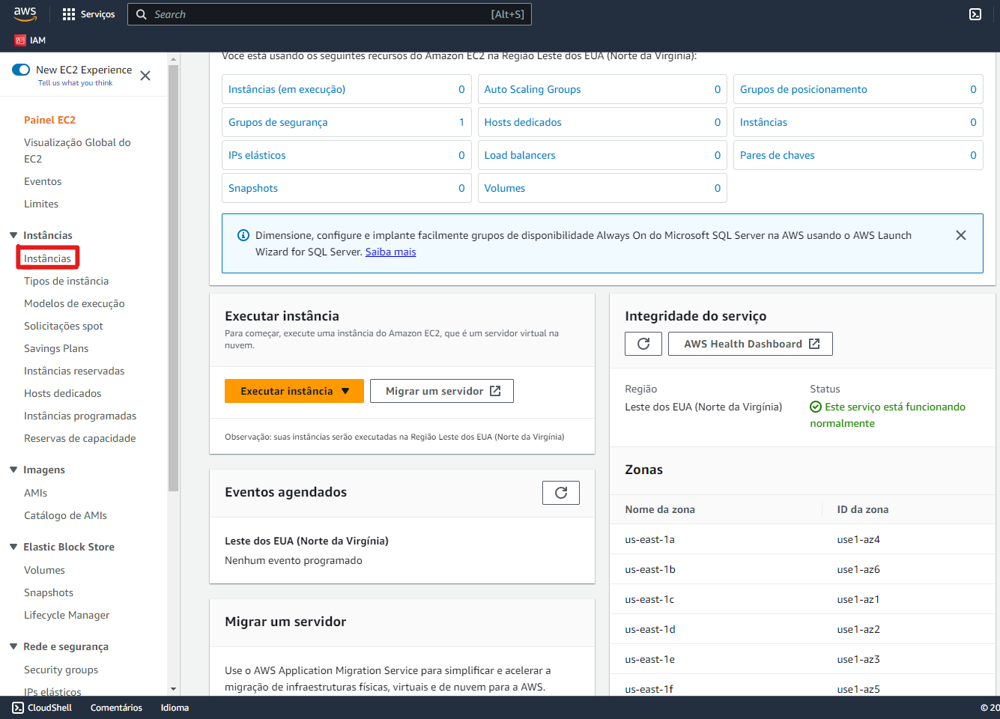 
  <li>Para criar uma nova instância, clique no botão 'Executar instâncias' no topo da página. 
  <li>Em 'Nome e tags', adicione um nome para a instância e tags (opcional). 
  <li>Na seleção das imagens da aplicação, selecione o grupo 'Amazon Linux', especificamente 'Amazon Linux 2 Kernel 5.10 AMI 2.0.20230504.1 x86_64 HVM gp2'. O ID dessa AMI (Amazon Image) deve ser: ami-06a0cd9728546d178. 
  <li>No 'Tipo de instância', selecione 't3.small'. 
  <li>Na sessão 'Par de chaves (login)', selecione o par de chaves criado anteriormente, ou gere um novo par para atribuir a essa instância. 
  <li>Na sessão 'Configurações de rede', marque a opção 'Criar grupo de segurança' e guarde o nome do grupo de segurança que será criado. Configurações específicas de rede para esse grupo serão feitas na documentação do próximo requisito. 
  <li>Na sessão 'Configurar armazenamento', selecione 16GB, tipo gp2 de volume raiz. 
  <li>Em 'Resumo', verifique as configurações selecionadas, certificando-se que o 'Número de instâncias' seja '1'. Clique no botão 'Executar instância'. 
</ol>

<h5>Gerar 1 elastic IP e anexar à instância EC2:</h5>
Este processo refere-se à geração de um IP elástico e sua associação à uma intânstância EC2, neste caso, realizado através da console web.
<ol>
  <li>No console web da AWS, através do menu 'Serviços', no canto superior esquerdo, acesse o serviço de 'EC2' (Elastic Compute Cloud). O termo 'EC2' também pode ser buscado através da barra de pesquisa, no topo da página. 
  <li>Na coluna esquerda, na sessão 'Redes e segurança', clique em 'IPs elásticos'. 
  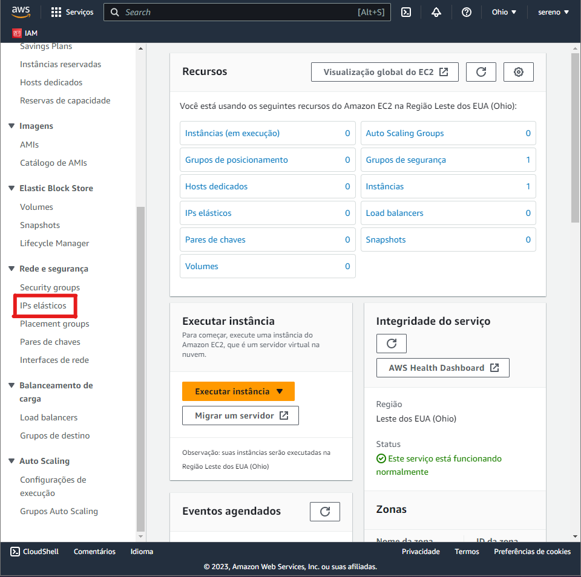 
  <li>Clique no botão 'Alocar endereço IP elástico', marque a opção 'Conjunto de endereços IPv4 da Amazon' e clique em 'Alocar'. 
  <li>Para associar o IP alocado à uma instância em execução selecione-o no painel de IPs, clique em 'Ações' e selecione a opção 'Associar endereço IP elástico'. 
  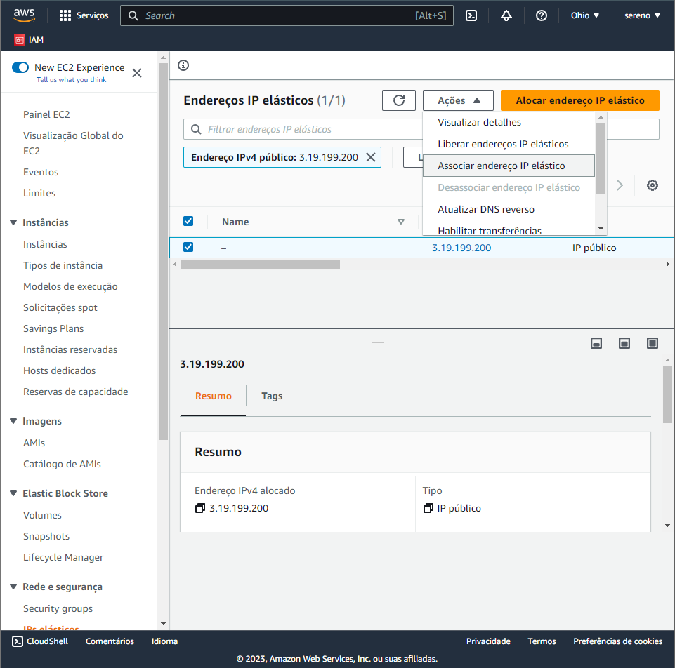 
  <li>Selecione 'Instância' no 'Tipo de recurso', escolha a instância que terá o IP associado e clique em 'Associar'.
   
</ol>

<h5>Liberar as portas de comunicação para acesso público:</h5>
Este processo refere-se à configuração de regras de entrada no grupo de segurança criado anteriormente, neste caso, realizado através da console web. As regras de segurança são: 22/TCP, 111/TCP e UDP, 2049/TCP/UDP, 80/TCP, 443/TCP. 
<ol>
  <li>No console web da AWS, através do menu 'Serviços', no canto superior esquerdo, acesse o serviço de 'EC2' (Elastic Compute Cloud). O termo 'EC2' também pode ser buscado através da barra de pesquisa, no topo da página. 
  <li>Na coluna esquerda, na sessão 'Rede e segurança', clique em 'Security groups'. 
  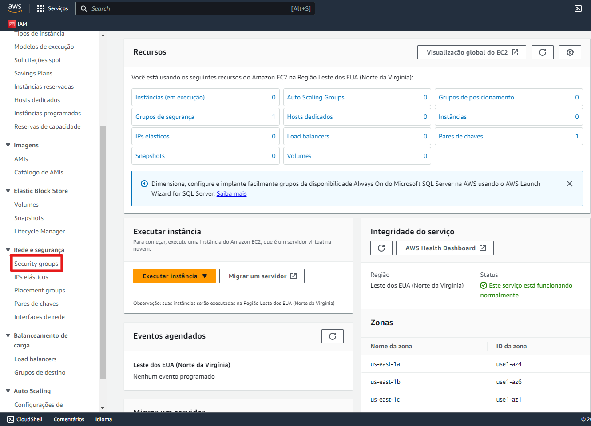 
  <li>Selecione o grupo de segurança criado anteriormente, clique no botão 'Ações' e 'Editar regras de entrada'. 
  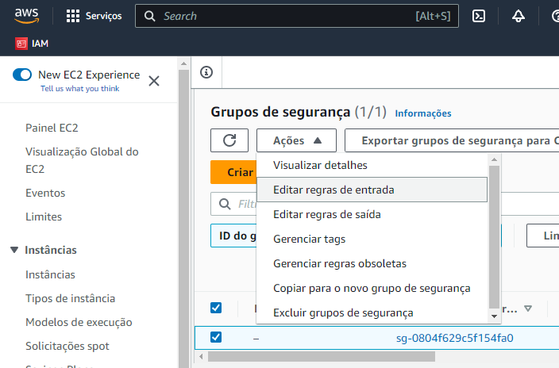 
  <li>Clique em 'Adicionar regra' ao inserir os dados de cada linha da tabela abaixo. 
  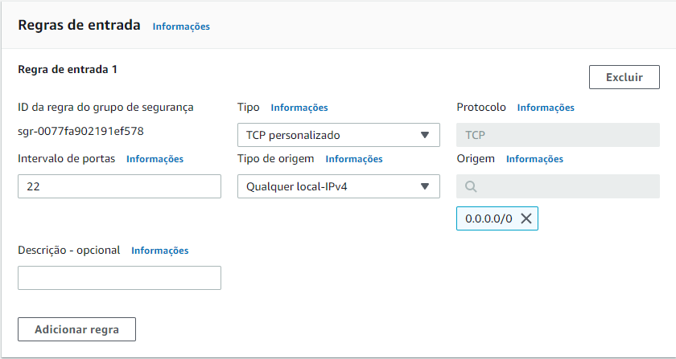  
  <table>
    <thead>
      <tr>
        <th>Tipo</th>
        <th>Intervalo de portas</th>
        <th>Tipo de origem</th>
    </thead>
    <tbody>
      <tr>
        <td>TCP personalizado</td>
        <td>22</td>
        <td>Qualquer local-IPv4</td>
      </tr>
      <tr>
        <td>TCP personalizado</td>
        <td>111</td>
        <td>Qualquer local-IPv4</td>
      </tr>
      <tr>
        <td>UDP personalizado</td>
        <td>111</td>
        <td>Qualquer local-IPv4</td>
      </tr>
      <tr>
        <td>TCP personalizado</td>
        <td>2049</td>
        <td>Qualquer local-IPv4</td>
      </tr>
      <tr>
        <td>UDP personalizado</td>
        <td>2049</td>
        <td>Qualquer local-IPv4</td>
      </tr>
      <tr>
        <td>TCP personalizado</td>
        <td>80</td>
        <td>Qualquer local-IPv4</td>
      </tr>
      <tr>
        <td>TCP personalizado</td>
        <td>443</td>
        <td>Qualquer local-IPv4</td>
      </tr>
   </table>
   <li>Após inseridas as 7 regras de entrada, clique em 'Salvar regras'. 
</ol>

<h5>Configurando um Network File System (NFS):</h5>
Este processo refere-se à criação de um NFS na instância EC2 criada anteriormente e a configuração de um diretório a ser compartilhado. 
<ol>
  <li>No terminal Linux, utilize o comando <code>mkdir /home/ec2-user/nfs/</code> para criar o diretório a ser compartilhado, nesse caso, localizado na pasta <code>/ec2-user</code>. 
  <li>Usando o comando <code>sudo yum update</code> atualize os pacotes instalados no sistema. 
  <li>A instalação dos pacotes referentes ao NFS podem ser incluídos no sistema via: <code>sudo yum install nfs-utils</code>. 
  <li>Para definir o diretório que será compartilhado, deve-se editar o arquivo <code>exports</code> no pasta <code>etc/</code> incluindo as informações: <caminho_do_diretorio_compartilhado> <ip_da_instancia>(rw,sync,no_subtree_check). 
  <li>Use o comando <code>sudo systemctl restart nfs-server</code> para reiniciar o serviço. 
  <li><code>systemctl status nfs</code> deve indicar que o serviço está ativo. 
  <li>Para conferir quais diretórios estão sendo compartilhados verifique o retorno do comando <code>sudo exportfs -v</code>. 
  <li>Por fim, para criar um diretório com o seu nome na pasta compartilhada, simplesmente execute o comando <code>mkdir /home/ec2-user/nfs/seu_nome/</code>. 
</ol>

<h5>Criando um servidor Apache:</h5>
Este processo refere-se à instalação de um servidor Apache na instância EC2 criada anteriormente. 
<ol>
  <li>No terminal Linux, execute o comando <code>sudo yum update</code> para atualizar os pacotes instalados no sistema. 
  <li>Instale os pacotes do Apache usando o comando <code>sudo yum install httpd</code>. 
  <li>Para iniciar o servidor digite <code>sudo systemctl start httpd</code>. 
  <li>Para verificar se o serviço está ativo utiliza-se o comando <code>systemctl status httpd</code>. O status deve estar ativo. 
  <li>Outra forma de verificar a disponibilidade do servidor é informando o endereço IP da instância na barra URL do navegador. Um site do Apache deve aparecer informando que o serviço está funcionando. 
</ol>

<h5>Script de verificação do status do serviço Apache:</h5>
Este processo refere-se à criação de um 'shell script' que tem a função de automatizar a verificação do status do serviço Apache gerado anteriormente. 
<ol>
  <li>O arquivo <code>apache_status.sh</code>, contido nesse repositório, tem a função de verificar o status do serviço <code>httpd</code>(Apache) e armazenar mensagens de log no diretório <code>/nfs</code>. 
  <li>O script possui a funcionalidade de criar os arquivos de log, caso ainda não existam, e adicionar a mensagem "Data-hora (fuso horário de São Paulo) + APACHE + ONLINE + SERVIDOR WEB ATIVO.", caso o serviço esteja ativo, e "Data-hora (fuso horário de São Paulo) + APACHE + OFFLINE + SERVIDOR WEB INATIVO.", caso contrário. 
</ol>
    
<h5>Preparar a execução automatizada do script a cada 5 minutos:</h5>
Este processo refere-se à execução automatizada do <code>apache_status.sh</code> a cada 5 minutos. 
<ol>
  <li>Execute o comando <code>crontab -e</code> para abrir, em modo de edição, o arquivo que armazena os scripts de automatização do sistema. 
  <li>Clique na letra <code>i</code> para ativar a função de inserção e adicione o comando: <code>*/5 * * * * /bin/bash <caminho_do_script></code>. Neste caso, o caminho do script é <code>/home/ec2-user/apache_status.sh</code>. 
  <li>Execute o comando <code>sudo systemctl restart crond</code>, para reiniciar o serviço de automatização. Agora o script <code>apache_status.sh</code> deve ser executado a cada 5 minutos. 
</ol>
            
<h5>Instalação do linux em uma máquina virtual:</h5>
Este processo refere-se à instalação da distribuição Oracle Linux 8.7 (sem interface gráfica), na Oracle VirtualBox 7.0, em uma máquina rodando o sistema operacional Windows 11. 
<ol>
  <li>Baixe e siga o processo de instalação do host para Windows do <a href="https://www.virtualbox.org/wiki/Downloads">Oracle VirtualBox 7.0</a>. 
  <li>Baixe o arquivo ISO completo da distribuição <a href="https://yum.oracle.com/oracle-linux-isos.html">Oracle Linux 8.7</a>. 
  <li>No VirtualBox clique no ícone 'Novo'. 
  <li>Use o campo 'Nome' para nomear a máquina virtual, selecione a imagem ISO baixada e marque a opção 'Pular instalação desassistida' se for o único a utilizar a instância criada. 
  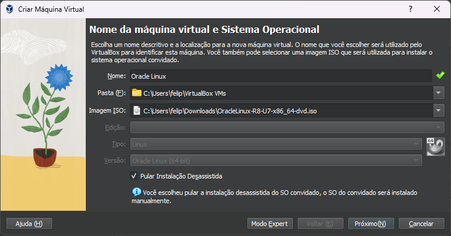 
  <li>Ao clicar em 'Próximo', selecione a quantidade de memória RAM e número de núcleos de processamento a serem utilizados. Recomenda-se, aproximadamente, 2MB e 1 núcleo de CPU. 
  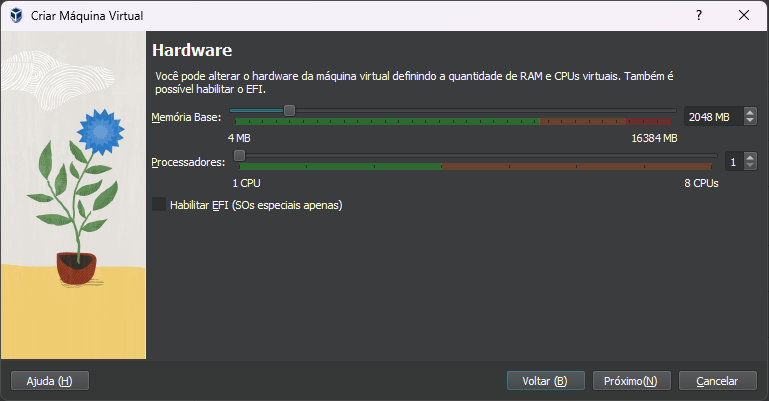 
  <li>Ao clicar em 'Próximo', selecione a quantidade de armazenamento em disco a ser utilizado. Recomenda-se 'Criar um novo disco rígido agora' e selecionar a opção padrão '20GB'. 
  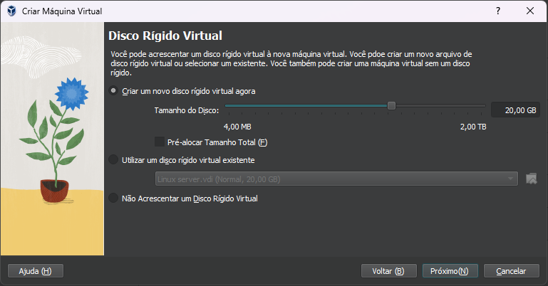 
  <li>Ao clicar em 'Próximo', revise as especificações realizadas e clique em 'Finalizar'. 
  <li>Para iniciar a máquina virtual criada, selecione-a na coluna a esquerda e clique no ícone 'Iniciar'. 
  <li>Na interface gráfica de instalação, deve-se atentar a algumas configurações importantes, como linguagem do teclado (br), seleção do software (server), rede (seleção da interface caso a máquina conecte-se a internet), definição de senha para o root e criação de um usuário comum do sistema. 
  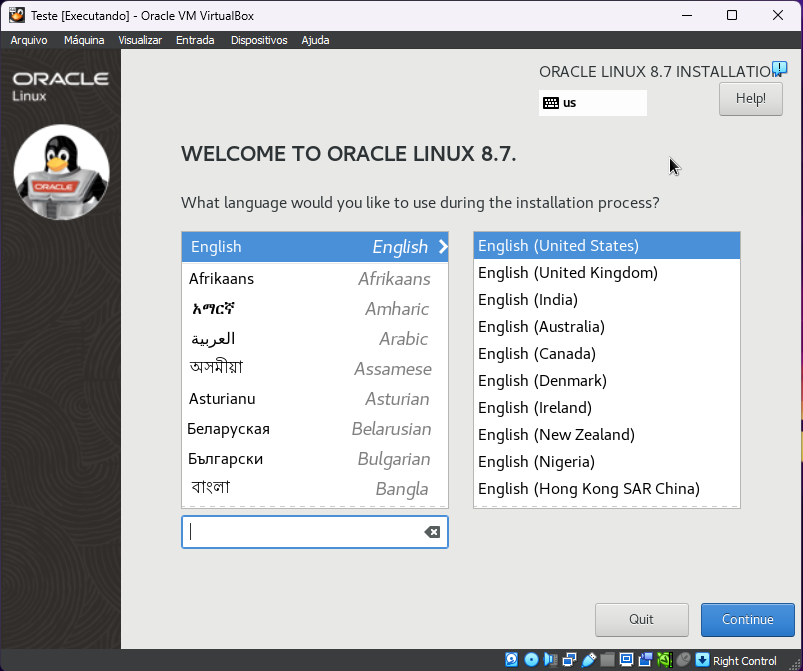 
  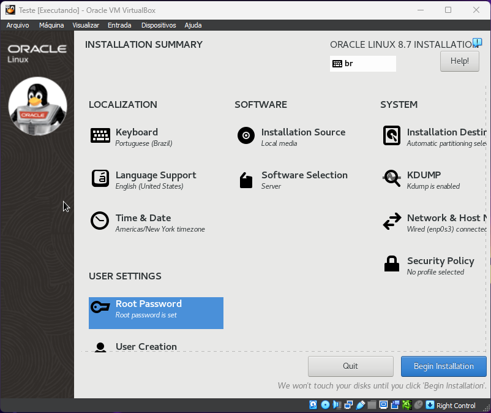 
  <li>Depois de revisar as configurações, clique em 'Begin Installation'. 
  <li>Finalizado o processo de instalação, clique em 'Reboot System'. 
  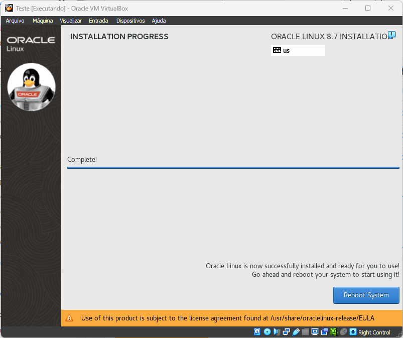 
</ol>
